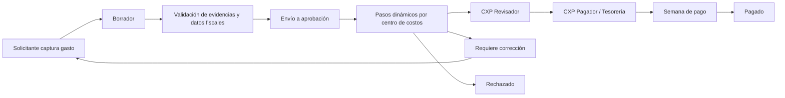
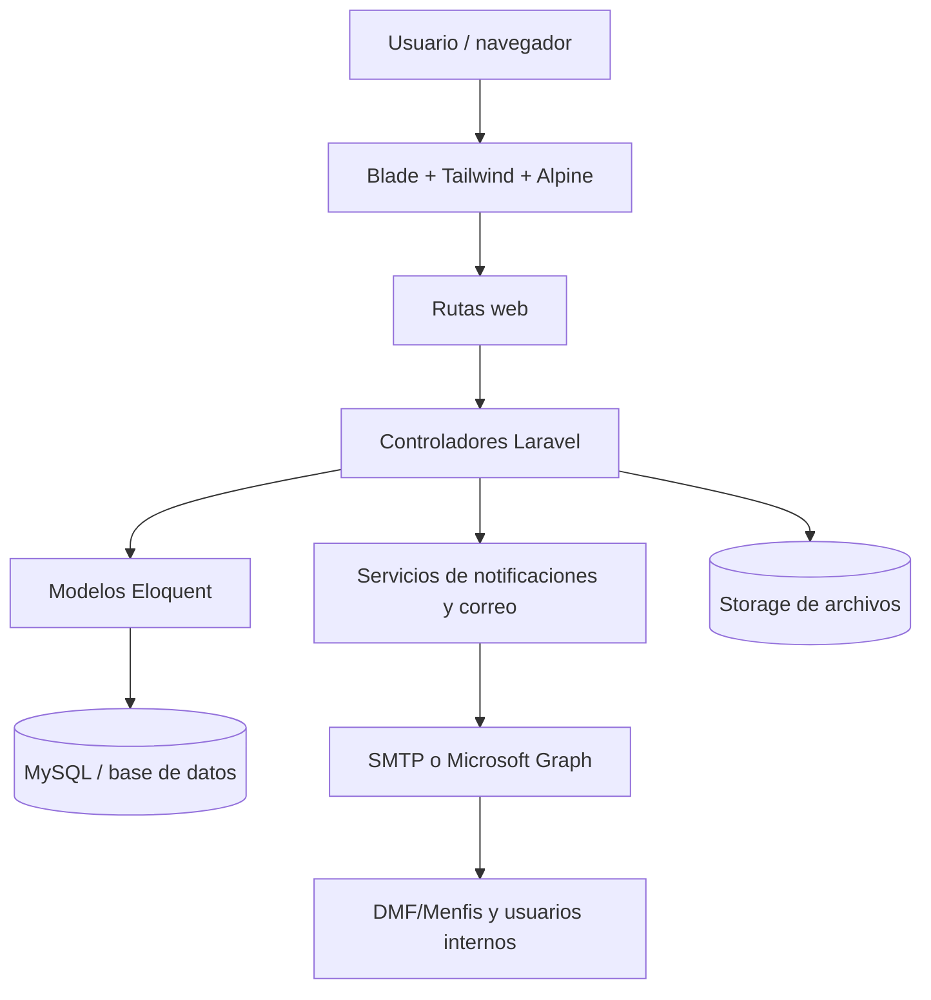
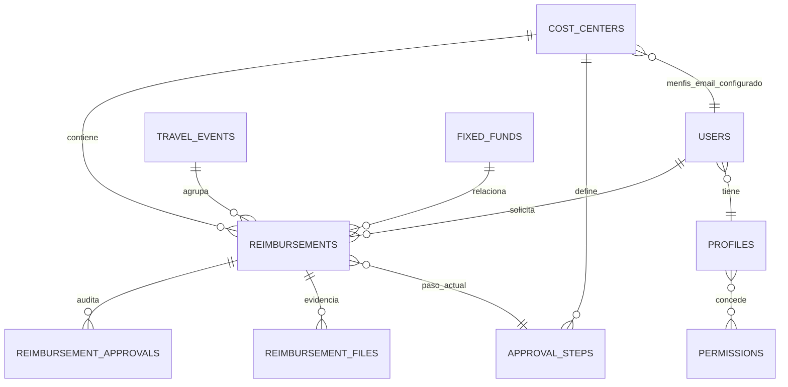

# Plataforma de Reembolsos

## Documento funcional, flujos autorizados, reglas y arquitectura técnica

**Versión:** 1.0  
**Fecha:** 31 de julio de 2026  
**Fuente principal:** implementación vigente del repositorio `reembolsos`.

> Este documento consolida la descripción funcional y técnica de la plataforma. Cuando una regla se deriva directamente del código se marca como **Implementado**. El repositorio no contiene los correos originales de DMF; por ello, el flujo de correo a DMF/Menfis se documenta con base en la implementación encontrada y queda pendiente de cotejo contra las autorizaciones formales recibidas por correo.

---

## 1. Propósito y alcance

La plataforma administra el ciclo de vida de solicitudes de reembolso y comprobación de gastos: captura de CFDI y evidencias, validación de información fiscal, asignación a centros de costos, aprobación multinivel, revisión de Cuentas por Pagar, autorización de pago, notificaciones y bitácora de auditoría.

El alcance incluye:

- Reembolsos, viáticos, comprobaciones con tarjeta empresarial y gastos asociados a eventos/viajes.
- Configuración de centros de costos, presupuesto, usuarios autorizados y flujo de aprobación.
- Perfiles y permisos diferenciados por función.
- Envío opcional de XML y PDF al correo configurado para Menfis/DMF.
- Control de pago y semana de procesamiento.

---

## 2. Actores, roles y responsabilidades

| Rol técnico | Nombre funcional | Responsabilidades principales | Alcance de acción |
|---|---|---|---|
| `admin` | Administrador (Full) | Configurar usuarios, perfiles, centros de costos, permisos y operar excepciones. | Global; puede aprobar y modificar según permisos administrativos. |
| `admin_view` | Administrador (Lectura) | Consulta, auditoría y seguimiento. | Sin modificaciones operativas. |
| `user` | Usuario general / solicitante | Crear borradores, cargar evidencias, enviar solicitudes y atender correcciones. | Sus solicitudes y centros de costos autorizados. |
| `director` | Director N1 | Revisar y aprobar el primer nivel del flujo. | Solicitudes asignadas por centro de costos. |
| `control_obra` | Control de Obra N2 | Validar el segundo nivel operativo. | Solicitudes asignadas por centro de costos. |
| `director_ejecutivo` | Director Ejecutivo N3 | Aprobar el nivel ejecutivo. | Centros de costos vinculados; sus propias solicitudes reinician normalmente en Control de Obra cuando existe ese nivel. |
| `accountant` | Cuentas por Pagar Revisador | Revisar la documentación después del flujo de aprobadores. | Solicitudes en `pendiente_revision_cxp`. |
| `direccion` | Subdirección / Dirección N5 | Aprobar el nivel directivo configurado. | Solicitudes asignadas por centro de costos. |
| `tesoreria` | Cuentas por Pagar Pagador | Autorizar la etapa final de pago y asignar semana de procesamiento. | Solicitudes en `pendiente_pago`. |

### 2.1 Modelo de autorización

La autorización combina tres mecanismos:

1. **Perfil y permisos RBAC:** `profiles`, `permissions` y `permission_profile` determinan capacidades de pantalla y operación.
2. **Asignación por centro de costos:** el centro de costos relaciona director, Control de Obra, Director Ejecutivo, CXP, Subdirección, Tesorería y usuarios autorizados.
3. **Pasos dinámicos:** `approval_steps` define el usuario y orden real de cada etapa. El flujo puede variar por centro de costos sin desplegar código.

También se soportan sustituciones temporales de aprobadores. La bitácora registra al usuario sustituto y, cuando aplica, al usuario originalmente asignado.

---

## 3. Tipos de solicitudes y evidencias

### Tipos funcionales

- **Reposición:** gasto pagado por el empleado que requiere devolución.
- **Viáticos / viaje:** gasto relacionado con un evento o viaje, con datos de destino, fechas, ubicación, noches y participantes.
- **Comida y categorías operativas:** pueden activar información adicional, como asistentes y nombres.
- **Tarjeta empresarial / comprobación:** valida el gasto corporativo y su evidencia; no necesariamente implica pago al empleado.
- **Fondo fijo:** gasto ligado a un fondo fijo y su centro de costos.

### Evidencias

- XML de CFDI.
- PDF de factura.
- Ticket físico o evidencia adicional.
- Datos fiscales extraídos del XML: UUID, RFC emisor/receptor, folio, fecha, subtotal, impuestos, total, moneda, método y forma de pago, uso de CFDI, régimen fiscal y conceptos.

Los archivos se almacenan mediante el sistema de storage de Laravel. Los borradores se guardan en rutas diferenciadas y pueden retomarse sin perder la información ya cargada.

---

## 4. Flujo operativo principal

### 4.1 Alta y envío

1. El usuario crea un borrador y carga XML, PDF y/o ticket.
2. El sistema analiza el CFDI y conserva los metadatos fiscales.
3. Al enviar, se identifica el centro de costos y se obtiene su flujo ordenado.
4. Si no existen pasos configurados, la solicitud puede quedar aprobada automáticamente.
5. Si existen pasos, se asigna el primer aprobador pendiente y el estado queda en `pendiente`.
6. Se registra la acción inicial del solicitante en la bitácora.

### 4.2 Aprobación multinivel

Cada aprobación:

- valida que el usuario sea el asignado, administrador, sustituto autorizado o pertenezca al grupo funcional correspondiente;
- registra usuario, paso, fecha, acción, comentarios y sustitución si aplica;
- actualiza el campo de aprobación legado cuando corresponde al nivel 1 a 6;
- intenta avanzar al siguiente paso;
- notifica al siguiente aprobador y al solicitante.

Al completar los pasos dinámicos del centro de costos, la solicitud pasa primero a `pendiente_revision_cxp`.

### 4.3 Corrección y rechazo

- `requiere_correccion`: devuelve la solicitud al propietario o creador para corregir evidencias o datos. Se conserva la observación y se notifica al propietario y, si es distinto, al creador por terceros.
- `rechazado`: finaliza la solicitud como no autorizada y notifica al propietario.
- Una corrección reenviada puede volver a disparar el correo a Menfis/DMF si conserva UUID, PDF y correo configurado.

### 4.4 Cuentas por Pagar y pago

1. **CXP Revisador:** recibe solicitudes en `pendiente_revision_cxp`, revisa la documentación y las mueve a `pendiente_pago`.
2. **CXP Pagador / Tesorería:** recibe solicitudes en `pendiente_pago`, registra su autorización y asigna `payment_week`.
3. **Pago:** la interfaz diferencia solicitudes listas para pago de aquellas que aún requieren autorización del pagador. El estado final de negocio es `pagado` cuando se confirma el pago.

---

## 5. Matriz de estados

| Estado | Significado | Quién actúa | Siguiente estado típico |
|---|---|---|---|
| `borrador` | Captura incompleta guardada. | Solicitante / creador por terceros. | `pendiente`, `en_evento` o permanece en borrador. |
| `en_evento` | Gasto asociado a un evento aún no enviado al flujo individual. | Participante / responsable del evento. | `pendiente`. |
| `pendiente` | Espera aprobación del paso actual. | Aprobador asignado, sustituto o administrador. | `pendiente`, `pendiente_revision_cxp`, `requiere_correccion` o `rechazado`. |
| `aprobado_director` | Marca histórica/compatibilidad del nivel Director N1. | Sistema / auditoría. | Siguiente nivel o CXP. |
| `aprobado_control` | Marca histórica/compatibilidad de Control de Obra N2. | Sistema / auditoría. | Siguiente nivel o CXP. |
| `aprobado_ejecutivo` | Marca histórica/compatibilidad del nivel ejecutivo. | Sistema / auditoría. | CXP Revisador. |
| `aprobado_direccion` | Marca histórica/compatibilidad de Subdirección. | Sistema / auditoría. | CXP o siguiente etapa configurada. |
| `aprobado_cxp` | Marca histórica/compatibilidad de CXP. | Sistema / auditoría. | Pago. |
| `aprobado_tesoreria` | Marca histórica/compatibilidad de autorización de tesorería. | Sistema / auditoría. | Pago. |
| `pendiente_revision_cxp` | Espera revisión documental/contable. | CXP Revisador. | `pendiente_pago`. |
| `pendiente_pago` | Espera autorización de pago o ya fue autorizada por CXP. | CXP Pagador / Tesorería. | `pagado`. |
| `pagado` | Pago confirmado. | CXP Pagador / Tesorería. | Fin del flujo. |
| `requiere_correccion` | El solicitante debe corregir información o evidencia. | Solicitante / creador. | `pendiente` o `rechazado`. |
| `rechazado` | Solicitud no autorizada. | Aprobador autorizado. | Fin del flujo. |
| `aprobado` | Estado legado de aprobación final; puede utilizarse para compatibilidad y reportes. | Sistema / administrador. | Fin o etapa financiera según contexto. |

> Los estados `aprobado_*` son marcas históricas compatibles con versiones anteriores. El flujo vigente usa principalmente `current_step_id`, `approval_steps`, `pendiente_revision_cxp` y `pendiente_pago`.

---

## 6. Reglas de negocio implementadas

### Reglas de autorización

- El administrador tiene acceso global conforme a las reglas de administración.
- El administrador de lectura no puede modificar información operativa.
- Un aprobador sólo puede actuar sobre su paso actual, salvo sustitución activa o privilegio administrativo.
- CXP Revisador sólo opera solicitudes en `pendiente_revision_cxp`.
- CXP Pagador / Tesorería sólo opera solicitudes en `pendiente_pago` que no tengan autorización de tesorería.
- Los usuarios ven solicitudes según su relación con el centro de costos, su paso asignado, su perfil o su pertenencia a las colas de CXP.

### Reglas de flujo

- Los pasos de aprobación se ordenan por `approval_steps.order`.
- Si el solicitante ya es aprobador de niveles inferiores o iguales, esos niveles se auto-aprueban y se registra la razón.
- Director Ejecutivo y Subdirección tienen una excepción jerárquica: cuando existe Control de Obra, el flujo inicia normalmente en ese nivel.
- Si el siguiente aprobador ya aprobó el mismo documento en un nivel previo, el sistema puede auto-aprobar ese paso.
- Si no hay más pasos, se envía a CXP Revisador antes de pasar a pago.
- Toda decisión se registra en `reimbursement_approvals`.

### Reglas documentales y fiscales

- Una factura con XML debe conservar UUID y datos críticos del CFDI.
- XML y PDF son las evidencias principales para el envío a Menfis/DMF.
- Los archivos tienen límite de 10 MB en la carga de borradores.
- Los datos derivados del XML se almacenan para auditoría y consulta.

### Reglas de presupuesto y organización

- Las solicitudes se vinculan a un centro de costos activo y, opcionalmente, a fondo fijo o evento.
- Los centros de costos tienen presupuesto, usuarios autorizados y responsables del flujo.
- Los eventos pueden tener presupuesto propio y agrupar gastos.
- La semana de pago se registra al autorizar el pago.

---

## 7. Flujos autorizados de correo DMF/Menfis

### 7.1 Alcance identificado en el sistema

El sistema implementa un destinatario configurable por centro de costos llamado `menfis_email`. El código no utiliza literalmente el nombre “DMF”, por lo que se asume que este correo representa el buzón autorizado de DMF/Menfis.

### 7.2 Cuándo se autoriza el envío

El correo se envía automáticamente cuando:

1. Se crea o envía un reembolso con UUID válido.
2. El centro de costos tiene un correo `menfis_email` válido.
3. El envío ocurre desde el flujo de carga masiva o alta normal.
4. Si la solicitud estaba en corrección, el propietario la reenvía con un nuevo PDF y conserva UUID y correo válido.

El correo no se envía si el centro de costos no tiene un correo válido configurado.

### 7.3 Contenido y adjuntos

- **Destinatario:** correo `menfis_email` del centro de costos.
- **Asunto:** nombre original del XML sin la extensión `.xml`; si no existe, `factura`.
- **Adjunto XML:** archivo XML original, conservando su nombre cuando está disponible.
- **Adjunto PDF:** PDF asociado, nombrado con la base del nombre del XML.
- **Vista del correo:** `emails.menfis_invoice`.

### 7.4 Notificaciones del flujo interno

Independientemente del correo a DMF/Menfis, el sistema genera notificaciones internas y por correo para:

- siguiente aprobador;
- solicitante después de una decisión;
- CXP Revisadores cuando la aprobación operativa termina;
- CXP Pagadores cuando CXP termina su revisión;
- propietario y creador cuando se requiere corrección;
- propietario cuando la solicitud es aprobada, rechazada o cambia de etapa.

### 7.5 Punto pendiente de validación documental

Para convertir este apartado en una transcripción formal de las autorizaciones de DMF se requiere anexar o proporcionar los correos fuente: remitente, fecha, destinatarios, asunto, condiciones de envío, excepciones y texto aprobado. En la versión actual, la fuente verificable es la implementación de `MenfisInvoiceMail`, `CostCenter::menfisEmailAddress()` y los puntos de envío del controlador.

---

## 8. Arquitectura técnica

### 8.1 Vista de componentes

### 8.2 Stack

- **Backend:** PHP 8.2+, Laravel 12.
- **Autenticación:** Laravel Breeze y sesiones.
- **Persistencia:** Eloquent ORM sobre MySQL/MariaDB según ambiente.
- **Frontend:** Blade, Tailwind CSS, Alpine.js, Axios y Vite.
- **Correo:** Mailables/Notifications de Laravel; el proyecto incluye transporte Microsoft Graph.
- **Archivos y PDF:** Laravel Storage, Dompdf, FPDF, FPDI, PDF Parser y ZipStream.
- **Pruebas:** PHPUnit/Laravel Test Runner.

### 8.3 Capas y responsabilidades

| Capa | Ubicación | Responsabilidad |
|---|---|---|
| Presentación | `resources/views`, `resources/js`, `resources/css` | Formularios, listados, dashboard, auditoría y visualización del flujo. |
| HTTP | `routes/web.php`, `app/Http/Controllers` | Autorización de entrada, validación, coordinación de casos de uso y respuestas. |
| Dominio/persistencia | `app/Models` | Entidades, relaciones, casts y reglas de autorización de reembolso. |
| Aplicación | `app/Services`, `app/Notifications`, `app/Mail` | Notificaciones agrupadas, correo, integración y tareas operativas. |
| Datos | `database/migrations`, `database/seeders` | Evolución del esquema, perfiles, permisos y configuraciones iniciales. |
| Infraestructura | `config`, `.env`, `storage`, `public` | Base de datos, correo, filesystem, logs y despliegue. |

### 8.4 Entidades principales

Entidades relevantes: `users`, `profiles`, `permissions`, `cost_centers`, `approval_steps`, `reimbursements`, `reimbursement_files`, `reimbursement_approvals`, `travel_events`, `fixed_funds`, `notification_batches` y tablas de relación de usuarios autorizados/sustitutos.

### 8.5 Auditoría y trazabilidad

La solicitud conserva:

- usuario propietario, creador y beneficiario;
- aprobadores por nivel y fecha;
- paso actual;
- observaciones;
- historial de decisiones;
- sustituciones;
- evidencias y nombres originales;
- datos fiscales extraídos.

La tabla `reimbursement_approvals` es la bitácora funcional de decisiones y notificaciones. Debe tratarse como registro de auditoría y no como sustituto del estado actual.

---

## 9. Seguridad y controles

- Contraseñas gestionadas por el framework y almacenadas con hash.
- Usuarios con soft delete.
- Protección CSRF y validación de formularios de Laravel.
- Control de acceso por perfil, permiso, centro de costos y paso actual.
- Control de sustituciones activas.
- Registro de inicios de sesión/dispositivos y posibilidad de bloqueo de usuarios.
- Validación del correo de Menfis/DMF antes de enviar.
- Errores de adjuntos de correo registrados en logs sin interrumpir el flujo principal.

---

## 10. Operación, despliegue y mantenimiento

El despliegue documentado usa un entorno PHP/Laravel con variables de entorno para aplicación, base de datos, almacenamiento y correo. Las tareas principales son:

1. instalar dependencias PHP y JavaScript;
2. configurar `.env`;
3. generar clave de aplicación;
4. ejecutar migraciones;
5. compilar assets con Vite;
6. configurar el servidor web apuntando a `public`;
7. asegurar permisos de `storage` y `bootstrap/cache`;
8. programar los comandos de recordatorios y procesamiento de notificaciones.

El proyecto incluye recordatorios periódicos para aprobaciones pendientes y un servicio que agrupa notificaciones para reducir correos individuales.

---

## 11. Riesgos, supuestos y recomendaciones

### Riesgos o puntos de atención

- La lógica de CFDI está acoplada a la estructura vigente de CFDI 4.0; cualquier cambio del SAT requiere revisión.
- Existen estados históricos y estados operativos simultáneamente; los reportes deben priorizar `current_step_id` y las colas de CXP.
- El correo DMF/Menfis se configura por centro de costos y no tiene una lista de autorización versionada en la base de datos.
- El envío de correo es síncrono en los puntos revisados; una falla se registra en log, pero no necesariamente bloquea la creación del reembolso.
- Las columnas de aprobación legado deben conservarse hasta retirar reportes o integraciones que aún las utilicen.

### Recomendaciones

- Incorporar los correos formales de DMF como anexo controlado con fecha, versión y aprobador.
- Definir catálogo formal de estados y retirar gradualmente estados históricos de la interfaz.
- Extraer la máquina de estados a un servicio de dominio o enum para evitar reglas duplicadas en controlador y vistas.
- Cubrir con pruebas las transiciones: auto-aprobación, sustitución, corrección, CXP, pago y envío a DMF/Menfis.
- Migrar el envío a cola si el volumen de facturas crece o si el proveedor externo requiere reintentos.
- Registrar en una bitácora de integración el destinatario, fecha, UUID, resultado y número de reintentos del envío a DMF/Menfis.

---

## 12. Referencias de implementación

- `project_architecture.md`: arquitectura previa y modelo general.
- `app/Models/User.php`: roles, perfiles, sustituciones y permisos.
- `app/Models/Reimbursement.php`: relaciones y autorización del paso actual.
- `app/Models/CostCenter.php`: configuración del centro de costos y correo Menfis.
- `app/Http/Controllers/ReimbursementController.php`: alta, aprobación, corrección, notificaciones y envío a Menfis.
- `app/Mail/MenfisInvoiceMail.php`: asunto, vista y adjuntos XML/PDF.
- `app/Notifications/*`: notificaciones internas y por correo.
- `database/migrations/*`: evolución del catálogo de roles, estados, flujos, CXP, pagos y auditoría.

