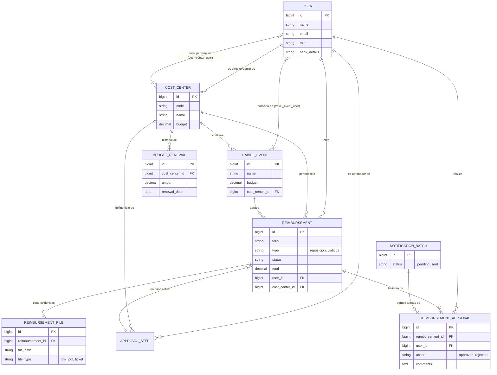
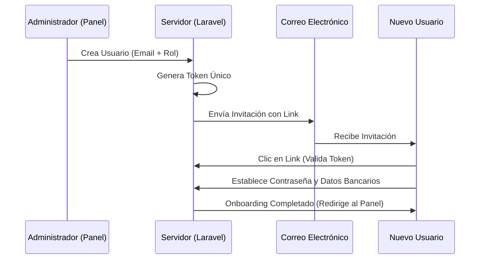
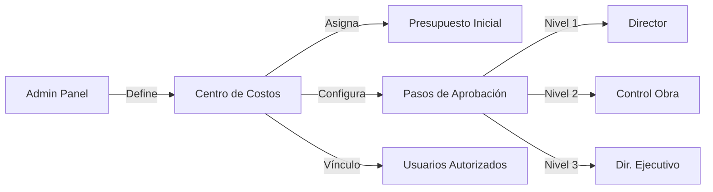
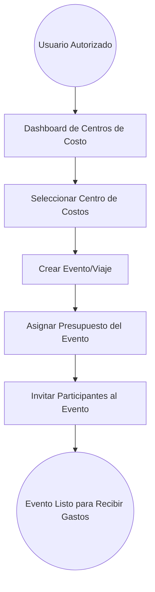
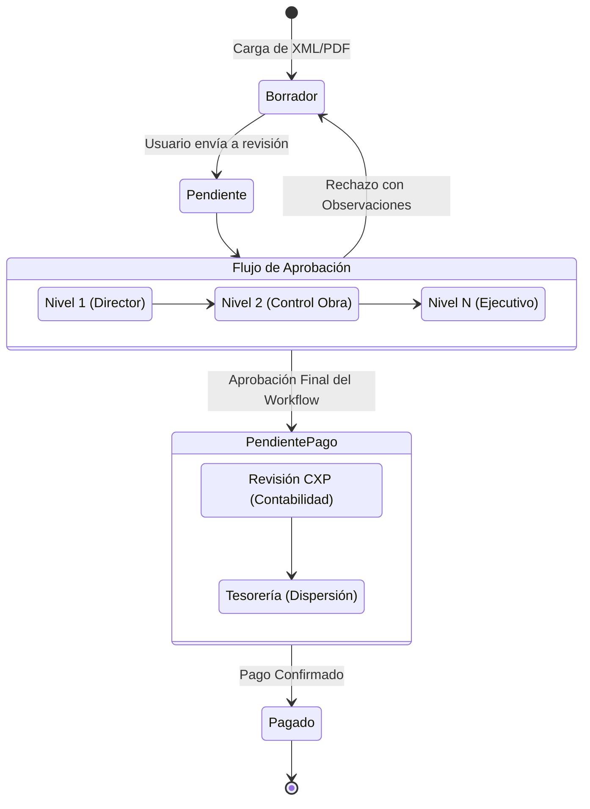

# Arquitectura y Documentación del Proyecto: Reembolsos

Este documento proporciona una visión técnica y funcional del sistema de reembolsos, detallando su estructura de datos, flujos de trabajo y capacidades de extensión.

---

## 1. Mapa de Base de Datos (ERD completo)

Este diagrama incluye las entidades principales y secundarias para una visión completa del flujo de datos.

---

## 2. Lista de Funcionalidades Detalladas

### A. Tipos de Gastos y Reembolsos

El sistema distingue claramente entre los procesos de reposición y comprobación:

- **Reposiciones**: Gastos comunes pagados por el empleado que requieren devolución de efectivo.
- **Viáticos**: Gastos relacionados con viajes y movilidad operativa.

- **Tarjeta Empresa (Comprobación)**: Gastos realizados con recursos corporativos. El flujo sirve para validar la deducibilidad y legalidad del gasto, pero no genera un pago al empleado.

### B. Motor de Validación y Evidencia

- **Ecosistema de Archivos (`reimbursement_files`)**: Relación estrecha para manejar múltiples evidencias (XML funcional, PDF visual y Tickets físicos).
- **Validación Fiscal**: Extracción de metadatos de CFDI 4.0 para asegurar que el RFC emisor y receptor sean correctos antes de permitir el envío.
- **Borradores Inteligentes**: Permite al usuario iniciar la carga y continuarla después sin perder los documentos ya subidos.

### C. Ciclo de Vida y Aprobación

- **Bitácora de Auditoría (`reimbursement_approvals`)**: Registro inmutable de cada decisión tomada sobre un gasto, permitiendo transparencia total.
- **Flujos Dinámicos (`approval_steps`)**: Cada Centro de Costos puede tener un camino de aprobación distinto, adaptándose a la jerarquía de cada proyecto.
- **Notificaciones Inteligentes (`notification_batches`)**: Sistema que agrupa alertas para evitar el spam de correos electrónicos a los directivos.

### D. Control Financiero y Presupuestal

- **Gestión de Presupuesto**: Los Centros de Costos tienen límites duros que se validan al momento de la creación de gastos.
- **Historial de Renovaciones (`budget_renewals`)**: Permite rastrear aumentos presupuestales a lo largo del tiempo.
- **Presupuestos de Eventos**: Los Viajes/Eventos pueden tener su propia bolsa de dinero, restando directamente del presupuesto del CC padre.

---

## 3. Mapas de Navegación Detallados

A continuación se detallan los flujos operativos clave del sistema.

### A. Flujo de Invitación y Onboarding de Usuario

Proceso por el cual un administrador integra a un nuevo empleado al sistema.

### B. Gestión de Centros de Costos y Jerarquías

Configuración de la estructura organizacional y reglas de aprobación.

### C. Generación de Viajes y Eventos

Sub-presupuestación para proyectos específicos.

### D. Ciclo de Vida del Reembolso: De la Solicitud al Pago

El camino completo de un gasto hasta su liquidación financiera.

---

## 4. Extensibilidad: ¿Cómo lograr nuevas funcionalidades?

Para escalar el sistema, es fundamental entender los siguientes puntos de enganche:

### Para agregar un Nuevo Tipo de Gasto

1.  **Modelo**: Extender el enum o constante en `Reimbursement.php`.
2.  **Vista**: Modificar `reimbursements.create` para habilitar campos específicos (ej. "gasolina" podría requerir lectura de odómetro).
3.  **Lógica**: Actualizar el `getTrueFolioAttribute` si el nuevo tipo requiere una nomenclatura de folio distinta.

### Para integrar con un ERP (SAP, Oracle, etc.)

- **Prerrequisito**: Asegurarse de que el campo `rfc_emisor` y `banco/cuenta` en la tabla `users` estén validados.
- **Acción**: El hook de integración debe dispararse cuando el `status` cambie a `pagado` o `aprobado_tesoreria`.

### Para Modificar el Workflow de Aprobación

- El sistema es **dinámico**. Para cambiar quién aprueba un Centro de Costos, solo se requiere editar los registros en la tabla `approval_steps`. No requiere cambios de código, lo que permite flexibilidad operativa sin despliegues técnicos.

### Deuda Técnica a Considerar

> [!WARNING]
> La validación de XML actualmente depende de la estructura CFDI 4.0. Si el SAT actualiza la versión, se debe actualizar el servicio de parsing en `ReimbursementController`.

> [!TIP]
> Para implementar notificaciones Push o Slack, se recomienda aprovechar el sistema de `NotificationBatch` ya existente para no saturar al usuario con correos individuales.
